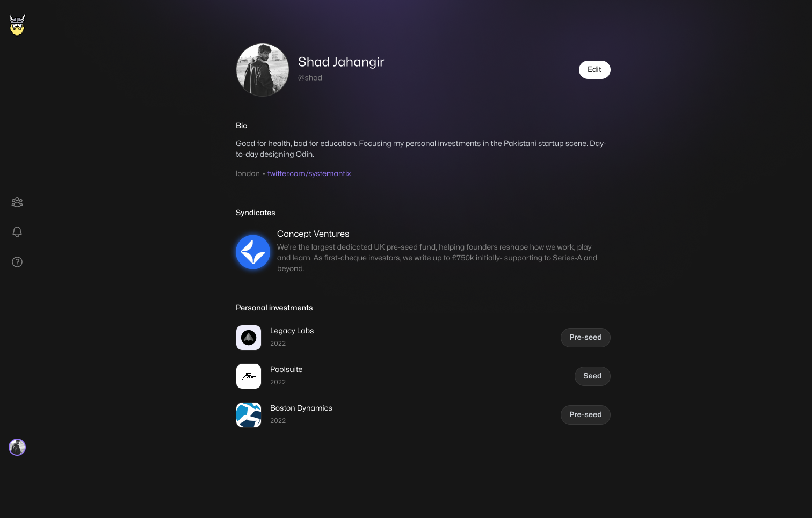
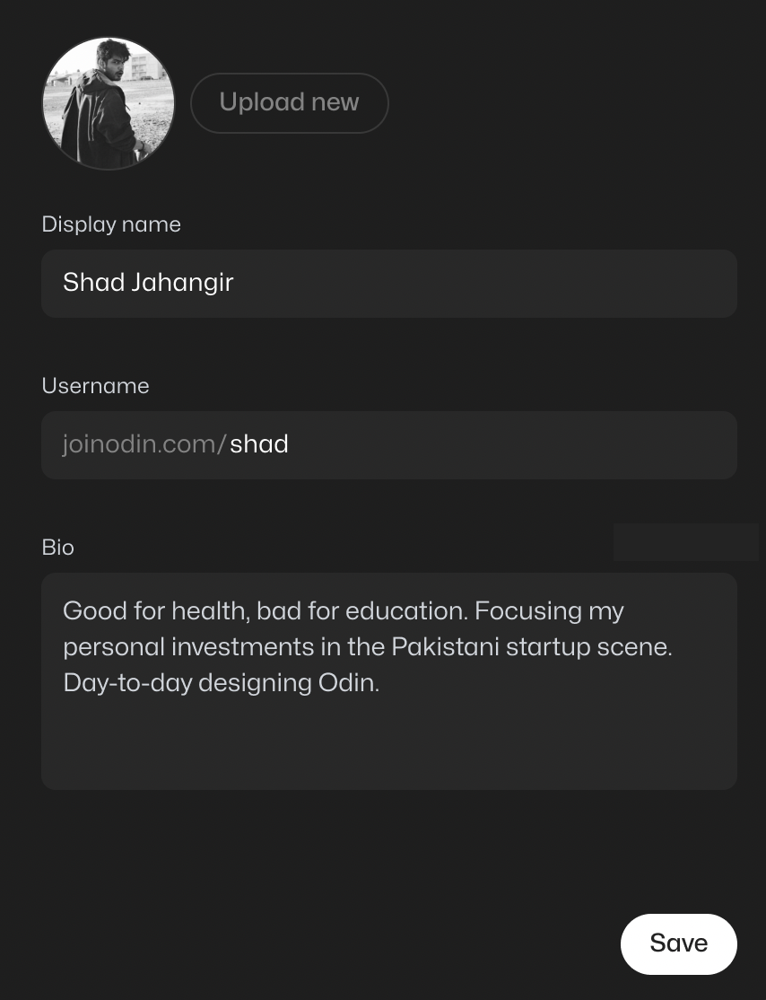

<div align="center">
<h1>Odin Frontend Tech Test</h1>

</div>

## 📗 Summary

Welcome to the Odin Frontend technical test!

This is a small challenge so that we can have an idea on how comfortable and fluent you're with React and modern Frontend technologies.

There are two parts to choose from, **Part A** & **Part B**, one is more UI oriented and the other involves a bit more logic. **You only need to complete one part**, choose the one you're more comfortable with. The recommended time block to complete the task is 3 hours.

### Workflow

**Please do not fork 🍴 this repository or open PRs on it**. Clone it, work on it locally, and once ready publish it as a separate repository, then send the link to us.

### Part A

The task is to implement the following page:



---

- [ ] Make it mobile first
- [ ] Handle the case for when the user has no investments (improvise the design)
- [ ] Handle loading states and possible fetch failures
- [ ] You do not need to build the navbar
- [ ] The font is [Mona Sans](https://github.com/github/mona-sans)
- [ ] Try to match the design, we value more if you think in terms of systems rather than just pixel perfection
- [ ] When you run the server (see instruction below) you can get the data at [`localhost:8000/profile`](http://localhost:8000/profile)

### Part B

If you choose part B, build an empty page with an "Edit" button, that when clicked opens a modal (or drawer) with the following form:



---

- [ ] Do not implement any avatar upload, ignore the `Upload new` button
- [ ] Submit the form by `PATCH` to `http://localhost:8000/profile`
- [ ] Handle form submission failure
- [ ] Add validation
  - **Display name** is required
  - **Username** is required and only letters or numbers are allowed (no symbols)
  - **Bio** is optional

### 💫 Tips

- Make it mobile-first
- Write small, single purpose components
- Feel free to use `fetch` or any library (`axios`) to get/patch the data
- Abstract re-usable components
- Handle happy and unhappy paths
- Clean code
- Separation of concerns
- Meaningful commit messages

### 💫 Bonus points

- Create a theme from the current design
- Type correctness
- Write some integration or unit tests
  - (there's already a setup done for you in `src/__tests__`)
- Make the application a11y friendly

## ☕️ Setup

Before you start, you will need:

- [Git](http://git-scm.com/book/en/v2/Getting-Started-Installing-Git)
- [Node.js](https://nodejs.org/download/)
- [`json-server`](https://github.com/typicode/json-server)

Clone this repository, once cloned, install the package manager by running:
```bash
$ corepack enable
```

then install all the dependencies:

```bash
$ pnpm i
```

Next install `json-server` globally to be able to run the mock API:

```bash
# or `npm i -g json-server` if you're not familiar with PNPm globals
$ pnpm add -g json-server
```

Finally, run the development server:

```bash
$ pnpm dev
```

and the API (in a separate terminal tab):

```bash
$ json-server --watch data/db.json --port 8000
```

You can now access the app at [`localhost:3000`](http://localhost:3000/) and the API on [`localhost:8000`](http://localhost:8000/).

Other useful commands:

```bash
# To run the tests once
$ pnpm test
# To run the tests in watch mode
$ pnpm test:watch
# Lint the codebase
$ pnpm lint
# Check type safety
$ pnpm types
# Run the production build locally
$ pnpm build && pnpm start
```

The [NextJS docs](https://nextjs.org/docs/getting-started) may be helpful if you hit any issues.

## 💬 Notes

### Component library

[Chakra UI](chakra-ui.com/) is already setup for you in this project. We use Chakra heavily at Odin, so we encourage you to try it in this project. If you find this is a blocker for you, feel free to switch to something else, such as [Tailwind](tailwindcss.com/) or [MUI](http://mui.com/).

### Package manager

This repository is setup with `pnpm`. If you have issues while running the project locally, feel free use an alternative package manager like `yarn` or `npm`.

### Typescript

In case you're not comfortable with Typescript, feel free to write Javascript. You'll just have to make this change in `tsconfig.json`:

```diff
- "strict": true,
+ "strict": false,
```

and work in `.jsx` files to get it working. Please note that at Odin, we only work in a typed environment, so any new joiner will be expected to learn it.
